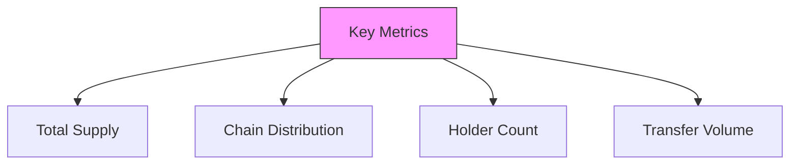

# How to Check USDT Distribution Across Blockchains

## Official Sources

### 1. Tether's Transparency Page
- **URL**: [transparency.tether.to](https://transparency.tether.to)
- **What you'll find**:
  - Total USDT in circulation
  - Breakdown by blockchain
  - Real-time updates
  - Reserve composition

## Blockchain Explorers

### 1. Ethereum (ERC-20)
- **Tool**: Etherscan
- **URL**: [etherscan.io/token/0xdac17f958d2ee523a2206206994597c13d831ec7](https://etherscan.io/token/0xdac17f958d2ee523a2206206994597c13d831ec7)
- **What to check**:
  - Total supply
  - Holders
  - Transfers
  - Contract information

### 2. Tron (TRC-20)
- **Tool**: Tronscan
- **URL**: [tronscan.org/#/token20/TR7NHqjeKQxGTCi8q8ZY4pL8otSzgjLj6t](https://tronscan.org/#/token20/TR7NHqjeKQxGTCi8q8ZY4pL8otSzgjLj6t)
- **What to check**:
  - Total supply
  - Holders
  - Transfers
  - Contract details

### 3. Solana (SPL)
- **Tool**: Solana Explorer
- **URL**: [explorer.solana.com/address/Es9vMFrzaCERmJfrF4H2FYD4KCoNkY11McCe8BenwNYB](https://explorer.solana.com/address/Es9vMFrzaCERmJfrF4H2FYD4KCoNkY11McCe8BenwNYB)
- **What to check**:
  - Total supply
  - Holders
  - Transfers
  - Token information

## Third-Party Analytics Platforms

### 1. DeFiLlama
- **URL**: [defillama.com/stablecoin/tether](https://defillama.com/stablecoin/tether)
- **Features**:
  - Cross-chain view
  - Historical data
  - Market share analysis
  - Chain distribution

### 2. CoinGecko
- **URL**: [coingecko.com/en/coins/tether](https://www.coingecko.com/en/coins/tether)
- **Features**:
  - Market data
  - Chain distribution
  - Historical charts
  - Trading volume

## Step-by-Step Guide

### Method 1: Using Tether's Official Page
1. Visit transparency.tether.to
2. Scroll to "Circulating Tether tokens"
3. View breakdown by blockchain
4. Check timestamp for last update

### Method 2: Using DeFiLlama
1. Visit defillama.com/stablecoin/tether
2. Scroll to "Chain Distribution"
3. View pie chart of distribution
4. Check historical data if needed

### Method 3: Using Blockchain Explorers
1. Choose appropriate explorer for chain
2. Enter USDT contract address
3. View "Token Information" section
4. Check total supply and holders

## Real-Time Monitoring Tools

### 1. Whale Alert (@whale_alert)
- **Platform**: Twitter
- **What it tracks**:
  - Large USDT transfers
  - Cross-chain movements
  - Minting/burning events

### 2. Tether Alerts (@tether_alerts)
- **Platform**: Twitter
- **What it tracks**:
  - USDT issuance
  - Chain migrations
  - Supply changes

## Best Practices for Checking

### 1. Verify Multiple Sources
- Check official Tether page
- Cross-reference with explorers
- Use analytics platforms
- Monitor social alerts

### 2. Consider Timing
- Check update timestamps
- Account for network delays
- Monitor for large changes
- Track historical trends

### 3. Important Metrics to Track

## Common Issues and Solutions

### 1. Different Numbers Across Platforms
- **Why**: Update delays, different calculation methods
- **Solution**: Use official Tether numbers as primary source

### 2. Historical Data Discrepancies
- **Why**: Chain migrations, network upgrades
- **Solution**: Cross-reference with official announcements

### 3. Supply Changes
- **Why**: Minting/burning events, chain swaps
- **Solution**: Monitor official alerts and announcements

## Tips for Regular Monitoring

1. **Set Up Alerts**
   - Follow official channels
   - Use monitoring tools
   - Set up custom notifications

2. **Track Major Changes**
   - Chain migrations
   - Large mints/burns
   - Significant transfers

3. **Stay Informed**
   - Follow Tether news
   - Monitor regulatory updates
   - Track market trends

## Resources for Developers

### 1. APIs
- Tether's API
- Blockchain explorer APIs
- Analytics platform APIs

### 2. Documentation
- Smart contract details
- Integration guides
- Technical specifications

## Remember
- Always use official sources
- Verify across multiple platforms
- Consider time delays in updates
- Monitor for significant changes
