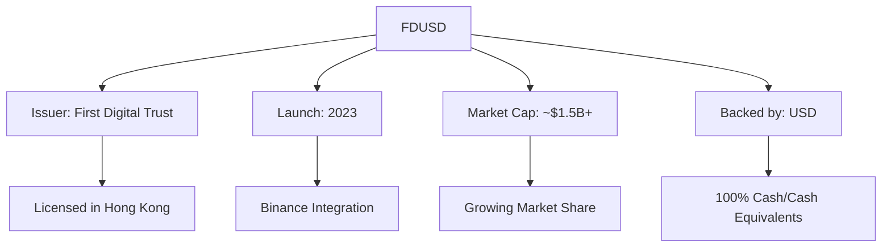
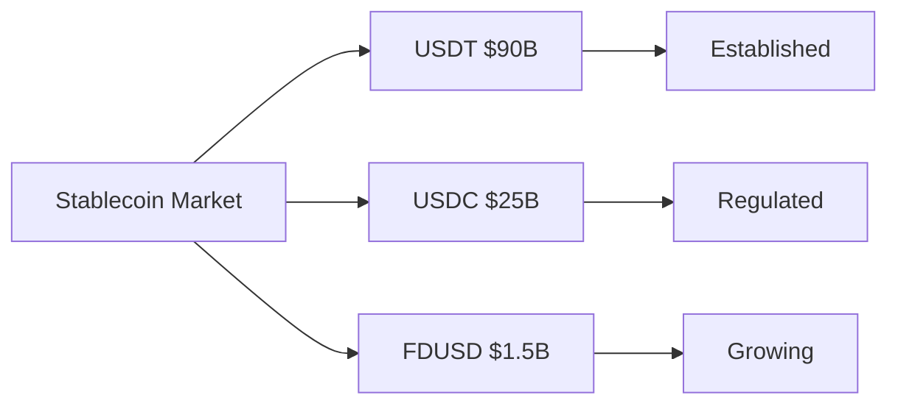
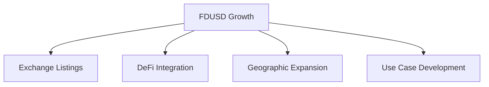

# FDUSD (First Digital USD) Analysis

## Overview

## Key Features

### 1. Issuer & Regulation
- **Issuer**: First Digital Trust (FDT)
- **Regulation**: Licensed in Hong Kong
- **Oversight**: Hong Kong regulatory framework
- **Launch Date**: 2023

### 2. Backing & Reserves
- **Reserve Composition**:
  - 100% Cash and Cash Equivalents
  - No commercial paper
  - No crypto assets
- **Transparency**: Regular attestations
- **Custodian**: First Digital Trust

### 3. Binance Integration
- **Primary Exchange**: Binance
- **Trading Pairs**: Major cryptocurrencies
- **Role**: BUSD replacement
- **Adoption**: Growing rapidly

## Market Position

### Current Statistics
- **Market Cap**: ~$1.5 billion (and growing)
- **Daily Volume**: ~$1 billion
- **Growth Rate**: Rapid expansion
- **Market Share**: Emerging player

### Comparison with Other Stablecoins

## Advantages

### 1. Regulatory Compliance
- Hong Kong licensed institution
- Clear regulatory framework
- Regular audits
- Transparent operations

### 2. Binance Support
- Native Binance integration
- High liquidity on Binance
- Marketing support
- Strategic partnership

### 3. Technical Features
- **Blockchain Support**:
  - BNB Chain (BEP-20)
  - Ethereum (ERC-20)
- **Smart Contract**: Modern implementation
- **Security**: Regular audits

## Use Cases

### 1. Trading
- Spot trading on Binance
- Futures trading
- Margin trading
- Cross-exchange arbitrage

### 2. Business Applications
- Cross-border payments
- Business settlements
- Treasury management
- International trade

### 3. DeFi Integration
- Lending platforms
- Yield farming
- Liquidity provision
- Automated market making

## Risk Assessment

### Strengths
1. Strong regulatory compliance
2. 100% cash backing
3. Binance partnership
4. Transparent operations

### Considerations
1. Relatively new
2. Limited blockchain support
3. Concentrated on Binance
4. Market dominance uncertainty

## Future Outlook

### Growth Potential

### Development Roadmap
1. **Short-term**
   - Increase trading pairs
   - Expand exchange listings
   - Enhance liquidity

2. **Medium-term**
   - Add blockchain support
   - DeFi partnerships
   - International expansion

3. **Long-term**
   - Institutional adoption
   - Banking partnerships
   - Global presence

## BUSD Transition Role

### Context
- BUSD phasing out
- Need for alternative stablecoin
- Binance ecosystem requirements
- Market opportunity

### Strategy
1. **Migration Path**
   - BUSD to FDUSD conversion
   - Seamless trading transition
   - Maintained liquidity
   - User education

2. **Market Position**
   - Fill BUSD void
   - Capture market share
   - Maintain stability
   - Build trust

## Best Practices for Users

### 1. Trading
- Start with small amounts
- Monitor liquidity
- Use official channels
- Understand fees

### 2. Storage
- Use secure wallets
- Verify contracts
- Keep records
- Regular monitoring

### 3. Risk Management
- Diversify holdings
- Monitor updates
- Stay informed
- Follow regulations

## Comparison with Other Stablecoins

### vs USDT
- More regulated
- Newer to market
- Less liquidity
- Better transparency

### vs USDC
- Similar regulation level
- Less market presence
- Focused on Binance
- Newer technology

### vs BUSD
- Natural successor
- Similar use cases
- Better long-term outlook
- Growing adoption

## Technical Implementation

### Smart Contract Features
- Pausable
- Blacklistable
- Upgradeable
- Multi-signature control

### Security Measures
- Regular audits
- Bug bounty program
- Security monitoring
- Incident response plan

## Conclusion

FDUSD represents a new generation of stablecoins with:
1. Strong regulatory compliance
2. 100% cash backing
3. Modern technical implementation
4. Strategic Binance partnership

Key considerations:
- Growing but still new
- Strong potential for growth
- Good regulatory standing
- Limited but expanding ecosystem
