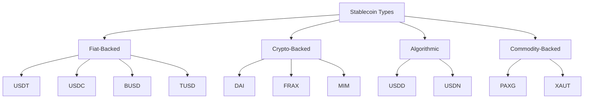
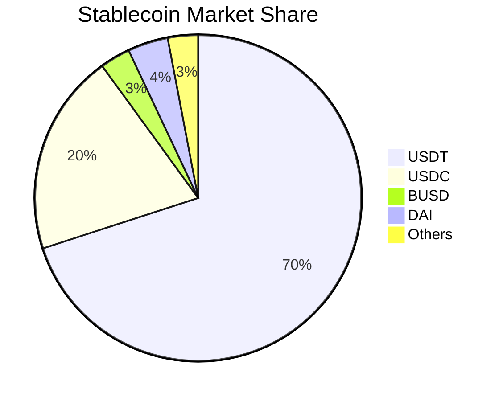

# Popular Stablecoins Overview

## Market Leaders by Category

## 1. Fiat-Backed Stablecoins

### USDT (Tether)
- **Market Cap**: ~$90 billion
- **Issuer**: Tether Limited
- **Backed By**: USD & US Treasury Bills
- **Key Feature**: Highest liquidity

### USDC (USD Coin)
- **Market Cap**: ~$25 billion
- **Issuer**: Circle & Coinbase
- **Backed By**: Cash & US Treasury Bills
- **Key Feature**: Strong regulatory compliance

### BUSD (Binance USD)
- **Market Cap**: ~$3 billion
- **Issuer**: Paxos & Binance
- **Backed By**: USD
- **Key Feature**: Binance ecosystem integration
- **Note**: Being phased out in 2024

### TUSD (TrueUSD)
- **Market Cap**: ~$3 billion
- **Issuer**: TrustToken
- **Backed By**: USD
- **Key Feature**: Real-time attestation

## 2. Crypto-Backed Stablecoins

### DAI
- **Market Cap**: ~$5 billion
- **Issuer**: MakerDAO
- **Backed By**: Crypto collateral (ETH, USDC, etc.)
- **Key Feature**: Decentralized governance

### FRAX
- **Market Cap**: ~$800 million
- **Issuer**: Frax Protocol
- **Backed By**: Partial crypto collateral + algorithmic
- **Key Feature**: Hybrid stability mechanism

### MIM (Magic Internet Money)
- **Market Cap**: ~$200 million
- **Issuer**: Abracadabra.money
- **Backed By**: Interest-bearing tokens
- **Key Feature**: Yield generation

## 3. Algorithmic Stablecoins

### USDD
- **Market Cap**: ~$700 million
- **Issuer**: Tron DAO
- **Mechanism**: Algorithmic + reserves
- **Key Feature**: High yield opportunities

### USDN (Neutrino USD)
- **Market Cap**: ~$100 million
- **Issuer**: Neutrino Protocol
- **Mechanism**: Algorithmic
- **Key Feature**: Waves ecosystem integration

## 4. Commodity-Backed Stablecoins

### PAXG (Pax Gold)
- **Market Cap**: ~$500 million
- **Issuer**: Paxos
- **Backed By**: Physical gold
- **Key Feature**: 1:1 gold backing

### XAUT (Tether Gold)
- **Market Cap**: ~$100 million
- **Issuer**: Tether
- **Backed By**: Physical gold
- **Key Feature**: Gold exposure with Tether's liquidity

## Market Share Distribution

## Comparison by Features

### Trading Volume
1. USDT (~$50B daily)
2. USDC (~$10B daily)
3. BUSD (~$2B daily)
4. DAI (~$200M daily)

### Chain Support
1. USDT (40+ chains)
2. USDC (15+ chains)
3. BUSD (2 chains)
4. DAI (10+ chains)

### Decentralization Level
1. DAI (Most decentralized)
2. FRAX
3. USDC
4. USDT/BUSD (Most centralized)

## Use Case Recommendations

### For Trading
1. USDT - Highest liquidity
2. USDC - US compliance
3. BUSD - Binance ecosystem

### For DeFi
1. DAI - Decentralized
2. USDC - Smart contract integration
3. FRAX - Yield opportunities

### For Institutions
1. USDC - Regulatory compliance
2. TUSD - Real-time attestation
3. USDT - Liquidity needs

### For Gold Exposure
1. PAXG - Regulated
2. XAUT - Higher liquidity

## Risk Assessment

### Low Risk
- USDC
- TUSD
- PAXG

### Medium Risk
- USDT
- DAI
- BUSD

### Higher Risk
- Algorithmic stablecoins
- New/untested stablecoins

## Future Trends

### Growing Sectors
1. Real World Asset (RWA) backed stablecoins
2. Regulated stablecoins
3. Central Bank Digital Currencies (CBDCs)

### Declining Sectors
1. Pure algorithmic stablecoins
2. Unregulated stablecoins
3. Small market cap stablecoins

## Best Practices for Users

### 1. Risk Management
- Diversify stablecoin holdings
- Monitor backing and attestations
- Stay informed about regulations

### 2. Usage Tips
- Match stablecoin to use case
- Consider gas fees on different chains
- Monitor liquidity needs

### 3. Security
- Use official sources
- Verify smart contracts
- Keep updated with audits
