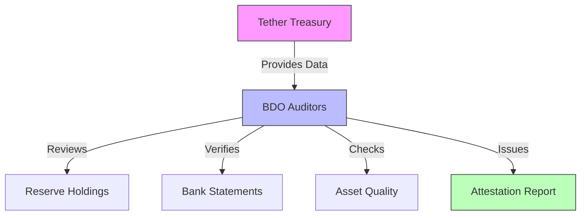
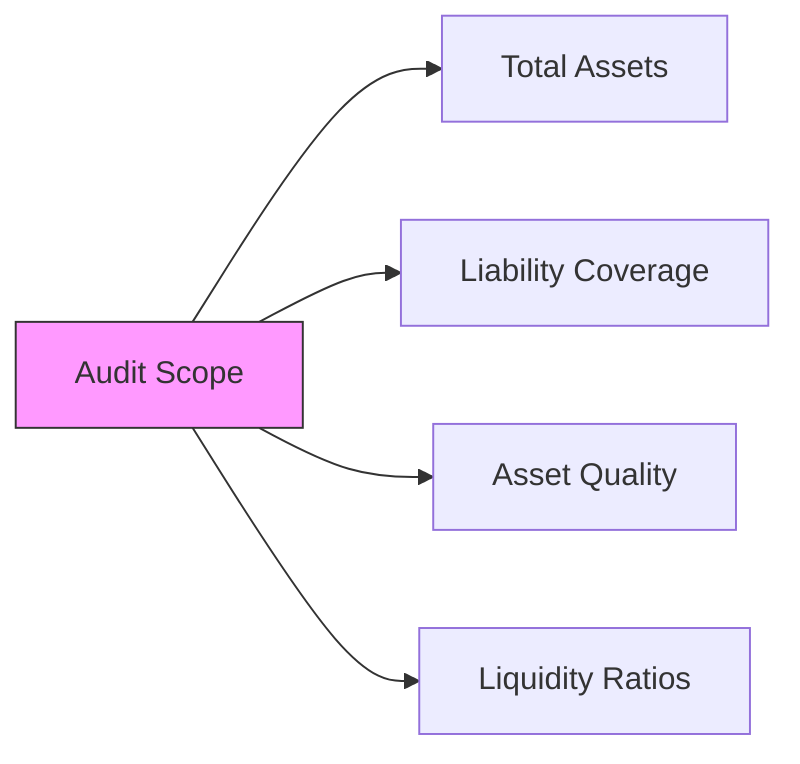
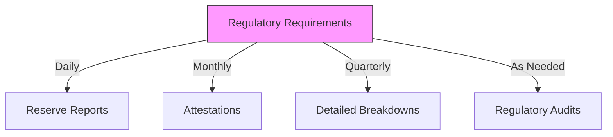
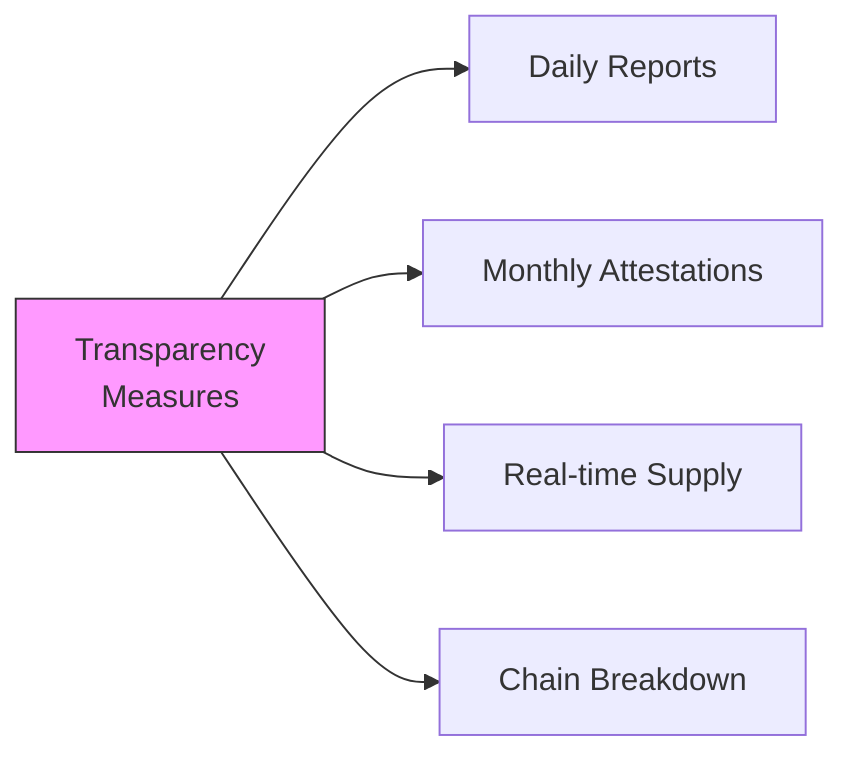

# Tether (USDT) Auditing and Reporting Process

## Current Auditor

### BDO (Binder Dijker Otte)
- **Type**: Global accounting firm
- **Rank**: 5th largest accounting network globally
- **Started**: October 2021
- **Frequency**: Monthly attestation reports

## Historical Auditors

### 1. Moore Cayman (2021)
- Provided quarterly attestations
- Focused on reserve backing
- Transitioned to BDO in late 2021

### 2. Friedman LLP (2017)
- Initial audit attempts
- Relationship dissolved
- No complete audit published

## What Gets Audited

### 1. Reserve Components
- Cash and cash equivalents
- Commercial paper
- Corporate bonds
- Digital tokens
- Secured loans
- Precious metals

### 2. Key Metrics Verified

## Reporting Process

### 1. Monthly Attestations
- **Frequency**: Every month
- **Publisher**: BDO
- **Scope**: Full reserve breakdown
- **Public Access**: Available on Tether's website

### 2. Transparency Reports
- **Frequency**: Daily
- **Type**: Self-reported
- **Content**: Total assets and liabilities
- **Location**: Tether's transparency page

## Regulatory Oversight

### 1. Primary Regulators
- New York Department of Financial Services (NYDFS)
- Financial Crimes Enforcement Network (FinCEN)
- Various international regulators

### 2. Legal Requirements

## Controversies and Responses

### 1. Historical Issues
- **2017**: Questions about full backing
- **2019**: NY AG investigation
- **2021**: CFTC fine ($41M)

### 2. Improvements Made
- More frequent attestations
- Increased transparency
- Regular reserve updates
- Reduced commercial paper holdings

## Current State (2023-2024)

### 1. Reserve Composition
- Majority in US Treasury Bills
- Reduced commercial paper exposure
- Increased cash and bank deposits
- More liquid assets

### 2. Transparency Initiatives

## Best Practices for Users

### 1. Verification Methods
- Check official Tether website
- Review latest attestation reports
- Monitor real-time supply data
- Track chain-specific balances

### 2. Risk Management
- Stay informed about reserve composition
- Monitor regulatory developments
- Understand backing mechanisms
- Follow official announcements

## Future Developments

### 1. Planned Improvements
- Enhanced transparency tools
- More detailed reporting
- Additional third-party verifications
- Blockchain-based verification systems

### 2. Industry Standards
- Working with regulators
- Setting industry benchmarks
- Improving audit procedures
- Enhancing public trust

## Important Resources

### 1. Official Sources
- Tether's Transparency Page
- BDO Monthly Attestations
- Regulatory Filings
- Official Announcements

### 2. Verification Tools
- Real-time Dashboard
- Chain Explorers
- Supply Trackers
- Reserve Reports

## Key Takeaways

1. **Regular Auditing**
   - Monthly attestations by BDO
   - Daily transparency updates
   - Regulatory oversight

2. **Multiple Layers of Verification**
   - Independent auditor (BDO)
   - Regulatory bodies
   - Public reporting
   - Blockchain verification

3. **Continuous Improvement**
   - Enhanced transparency
   - More frequent reporting
   - Better reserve composition
   - Stronger regulatory compliance
