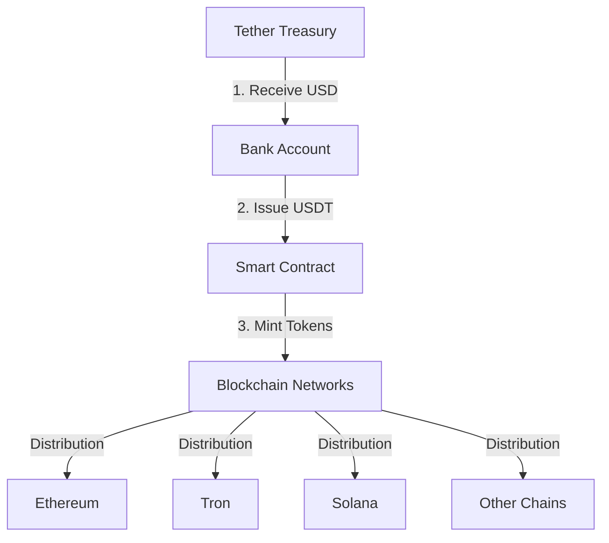
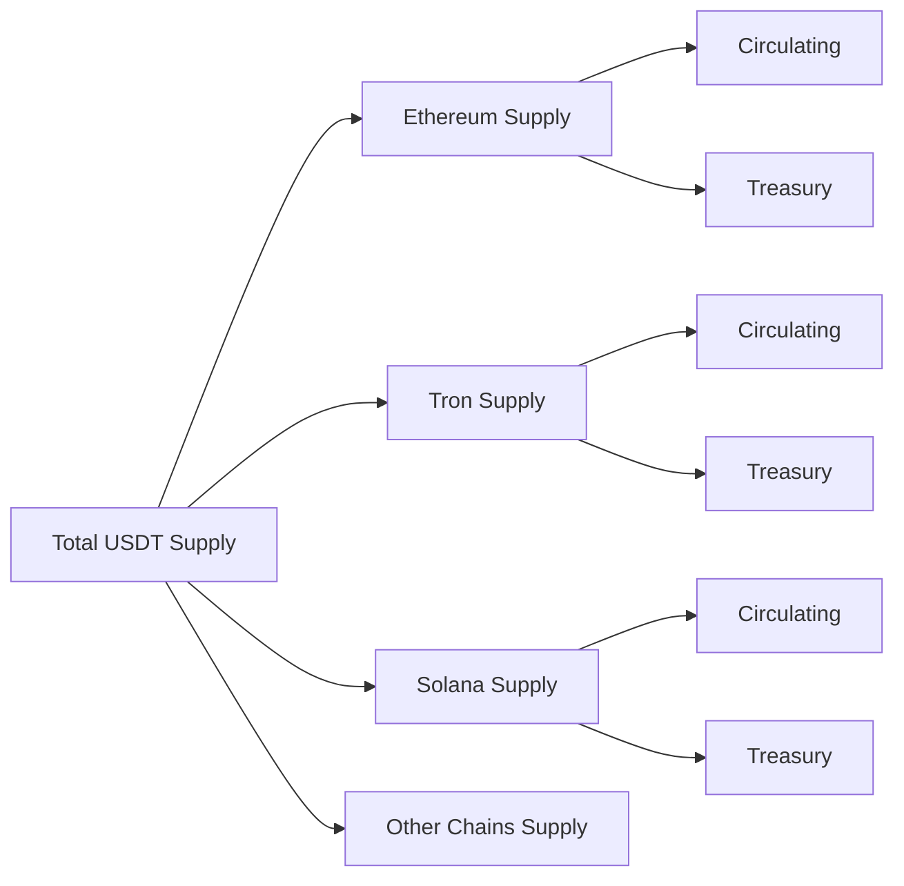

# USDT Creation and Management Across Blockchains

## Overview of USDT



## Creation Process

### 1. Fiat Backing
- **Step 1**: Users/Institutions deposit USD to Tether's bank account
- **Step 2**: Tether verifies the deposit
- **Step 3**: Equivalent USDT is authorized for minting

### 2. Smart Contract Minting
```solidity
// Simplified example of USDT minting function
function mint(address _to, uint256 _amount) public onlyOwner {
    require(!paused, "Minting is paused");
    require(_to != address(0), "Invalid address");
    
    totalSupply = totalSupply.add(_amount);
    balances[_to] = balances[_to].add(_amount);
    
    emit Mint(_to, _amount);
}
```

### 3. Multi-Chain Deployment

#### Ethereum (Original)
- **Contract Type**: ERC-20
- **Features**:
  - Pausable
  - Blacklistable
  - Upgradeable
- **Creation Method**: Direct minting by Tether

#### Tron
- **Contract Type**: TRC-20
- **Features**:
  - Similar to ERC-20
  - Optimized for Tron network
- **Creation Method**: Direct minting by Tether

#### Solana
- **Contract Type**: SPL Token
- **Features**:
  - Native Solana token standard
  - High throughput
- **Creation Method**: Direct minting by Tether

## Supply Management

### 1. Treasury Management
- **Minting**: Based on USD deposits
- **Burning**: When USDT is redeemed for USD
- **Monitoring**: Real-time supply tracking
- **Transparency**: Regular attestation reports

### 2. Cross-Chain Balance


## Technical Implementation

### 1. Smart Contract Architecture

#### Base Token Contract
```solidity
contract TetherToken is Pausable, BlackListable, Upgradeable {
    string public name;
    string public symbol;
    uint8 public decimals;
    uint256 public totalSupply;
    
    mapping(address => uint256) public balances;
    mapping(address => mapping(address => uint256)) public allowed;
    
    // Core functions
    function transfer(address _to, uint256 _value) public returns (bool);
    function approve(address _spender, uint256 _value) public returns (bool);
    function transferFrom(address _from, address _to, uint256 _value) public returns (bool);
}
```

### 2. Security Features

#### Access Control
- **Owner Functions**:
  - Minting
  - Burning
  - Pausing
  - Blacklisting
  
#### Safety Measures
- **Supply Caps**: Maximum supply limits
- **Pause Mechanism**: Emergency stop
- **Upgrade Path**: Contract upgradeability

## Regulatory Compliance

### 1. KYC/AML Integration
- Verification requirements
- Blacklist functionality
- Transaction monitoring

### 2. Reporting
- Supply attestations
- Reserve audits
- Regulatory reporting

## Cross-Chain Management

### 1. Supply Distribution
- Each blockchain has its own supply
- Total supply across all chains is tracked
- Regular rebalancing between chains

### 2. Bridge Integration
- Official bridge partnerships
- Security protocols
- Cross-chain transfer limits

## Best Practices for Integration

### 1. For Developers
- Always use official contracts
- Implement proper security checks
- Monitor for upgrades

### 2. For Users
- Verify contract addresses
- Use official channels
- Check chain compatibility

## Future Developments

### 1. Planned Improvements
- Enhanced transparency
- Additional chain support
- Improved cross-chain functionality

### 2. Technical Roadmap
- Smart contract upgrades
- Security enhancements
- Protocol optimizations
