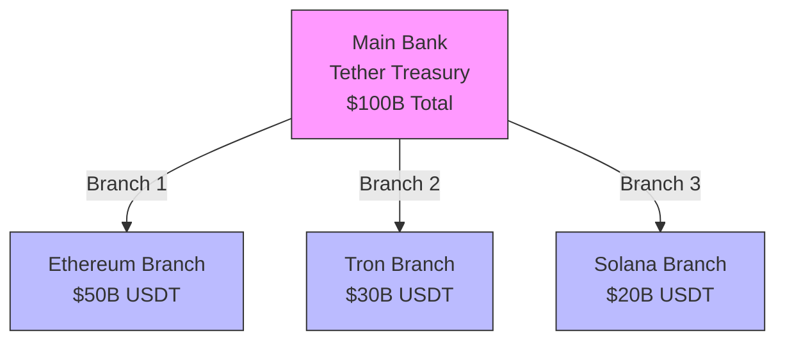
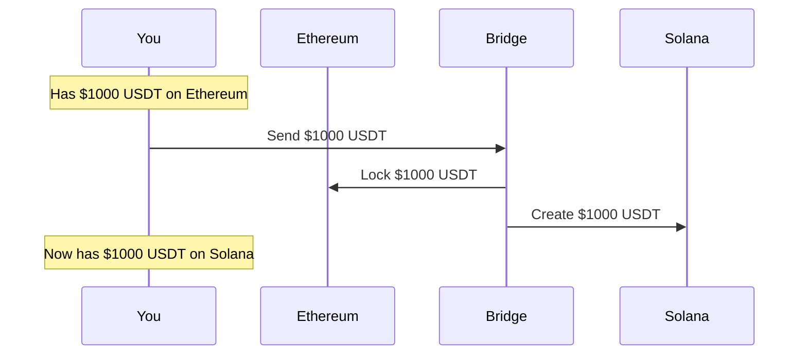
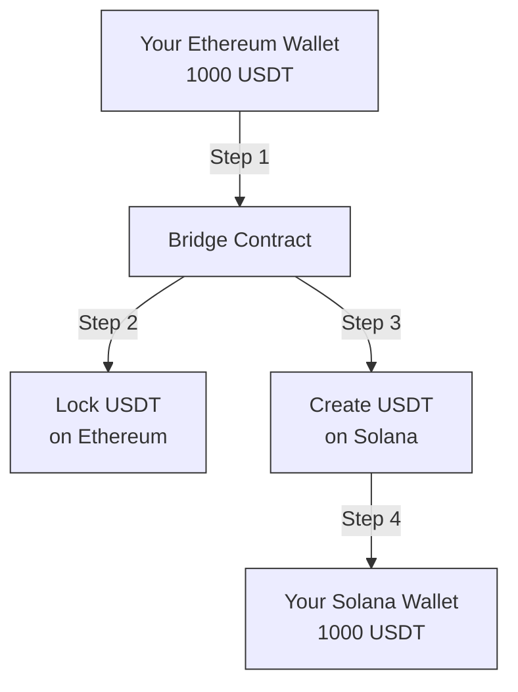

# Understanding USDT Cross-Chain Balance: A Beginner's Guide

## Simple Analogy: The Bank Branch System 🏦

Think of USDT like a bank with multiple branches in different cities:
- The main bank (Tether Treasury) keeps track of all money
- Each blockchain is like a different city branch
- The total money across all branches must match the main bank's records



## How It Works: Step by Step 🔄

### 1. The Big Picture
- Total USDT Supply: $100 Billion (example)
- Each blockchain has a portion of this total
- All portions add up to the total supply

### 2. Real-World Example

Let's say you have $1000 USDT:



#### What Actually Happens:
1. **On Ethereum**:
   - Your $1000 USDT is locked 🔒
   - Can't be used until unlocked
   - Still counts in Ethereum's total

2. **On Solana**:
   - New $1000 USDT is created ✨
   - You can use it on Solana
   - Adds to Solana's total

3. **Overall Balance**:
   - Total USDT supply stays the same
   - Just moved between "branches"

## Simple Math Example 🔢

### Starting Point
```
Total USDT = $100
- Ethereum: $70
- Solana: $30
```

### After Your Transfer ($10)
```
Total USDT = $100 (unchanged!)
- Ethereum: $60 ($70 - $10)
- Solana: $40 ($30 + $10)
```

## Common Questions Answered ❓

### 1. "Is my USDT duplicated?"
- No! It's like moving money between bank accounts
- Locked on one chain, created on another
- Total amount stays the same

### 2. "What backs my USDT?"
- Real USD in Tether's bank accounts
- Same dollar can't be used twice
- Regularly audited and reported

### 3. "Is it safe?"
- Protected by smart contracts
- Verified by multiple parties
- Monitored by Tether

## Visual Guide: Moving USDT Between Chains 🔄



## Safety Tips for Beginners 🛡️

1. **Always Double-Check**:
   - Destination address
   - Amount to transfer
   - Network fees

2. **Start Small**:
   - Test with small amounts first
   - Make sure everything works
   - Then move larger amounts

3. **Use Official Tools**:
   - Official bridges
   - Verified contracts
   - Trusted platforms

## Remember 🌟

- USDT total supply stays the same
- Only the distribution changes
- Like moving money between bank branches
- Always verify before transferring

## Need Help? 🆘

- Check official Tether documentation
- Use trusted exchanges
- Contact support if unsure
- Never share private keys
