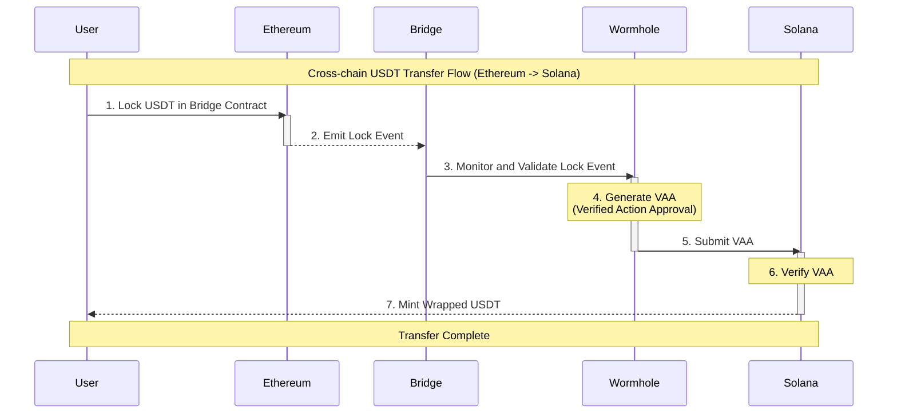

# Understanding Cross-Chain USDT Transfer (Ethereum to Solana)

## Overview
This document explains the process of transferring USDT from Ethereum blockchain to Solana blockchain using Wormhole as the bridge protocol.

## Detailed Flow Explanation

1. **Lock USDT in Bridge Contract**
   - User initiates transfer by sending USDT to a bridge smart contract on Ethereum
   - USDT tokens are locked in the bridge contract
   - This ensures tokens can't be double-spent

2. **Emit Lock Event**
   - Bridge contract emits an event containing:
     - Amount of USDT locked
     - Destination address on Solana
     - Transaction details

3. **Monitor and Validate Lock Event**
   - Wormhole Guardian network monitors the bridge contract
   - Validates the lock event's authenticity
   - Ensures transaction meets protocol requirements

4. **Generate VAA (Verified Action Approval)**
   - Wormhole Guardians create a VAA
   - VAA contains:
     - Source chain info (Ethereum)
     - Destination chain info (Solana)
     - Amount to be transferred
     - User's destination address
     - Signatures from Guardian network

5. **Submit VAA to Solana**
   - VAA is submitted to Solana blockchain
   - Contains proof of locked tokens on Ethereum

6. **Verify VAA on Solana**
   - Solana bridge program verifies:
     - Guardian signatures
     - Transaction hasn't been processed before
     - All protocol requirements are met

7. **Mint Wrapped USDT**
   - Upon successful verification:
     - Solana bridge mints equivalent wrapped USDT
     - Tokens are sent to user's Solana address
     - These tokens are 1:1 backed by locked USDT on Ethereum

## Security Considerations
- The process is secured by:
  - Cryptographic proofs
  - Multiple validator signatures
  - Smart contract security measures
  - Guardian network consensus

## Important Notes
- Transfer times can vary based on:
  - Network congestion
  - Gas fees
  - Guardian network response time
- Always use official bridge interfaces
- Verify destination addresses carefully
- Ensure sufficient gas fees on both chains

# Popular Bridge Protocols Comparison

## 1. Wormhole
- **Type**: Decentralized, Generic Message Passing
- **Key Features**:
  - Supports multiple chains (Ethereum, Solana, BSC, etc.)
  - Guardian network for validation
  - Generic message passing capability
  - Native token bridging
- **Security Model**: Multi-party computation (MPC) with Guardian network
- **Notable Projects**: Portal Bridge, Token Bridge

## 2. LayerZero
- **Type**: Omnichain Interoperability Protocol
- **Key Features**:
  - Ultra-light nodes
  - Oracle and Relayer system
  - Cross-chain messaging
  - Configurable trustlessness
- **Security Model**: Dual oracle and relayer system
- **Notable Projects**: Stargate Finance, ApeCoin Bridge

## 3. Multichain (formerly AnySwap)
- **Type**: Cross-chain Router Protocol
- **Key Features**:
  - Multiple liquidity models
  - Direct swap functionality
  - No wrapped tokens needed in some cases
  - Support for 40+ chains
- **Security Model**: MPC nodes and threshold signatures
- **Notable Projects**: Many DEXes integrations

## 4. Polygon Bridge
- **Type**: Plasma & PoS Bridge
- **Key Features**:
  - Dedicated to Polygon ecosystem
  - High throughput
  - Lower gas fees
  - Fast transfers
- **Security Model**: Proof of Stake validators
- **Notable Projects**: Native Polygon ecosystem

## 5. Synapse Protocol
- **Type**: Cross-chain Bridge and AMM
- **Key Features**:
  - Liquidity aggregation
  - Optimized bridging paths
  - Native swap functionality
  - Multiple chain support
- **Security Model**: Validator network with economic security
- **Notable Projects**: Synapse Bridge

## Bridge Security Considerations

### Common Security Features
1. **Validation Mechanisms**
   - Multi-signature requirements
   - Validator networks
   - Proof verification systems

2. **Risk Mitigation**
   - Delayed transfers for large amounts
   - Insurance funds
   - Security audits
   - Bug bounty programs

3. **Potential Risks**
   - Smart contract vulnerabilities
   - Validator collusion
   - Oracle manipulation
   - Network congestion

### Best Practices for Users
1. Start with small test transactions
2. Use established bridges with proven track records
3. Verify destination addresses carefully
4. Check bridge status and network conditions
5. Be aware of gas fees on both chains