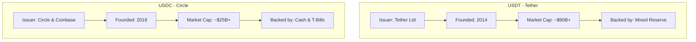
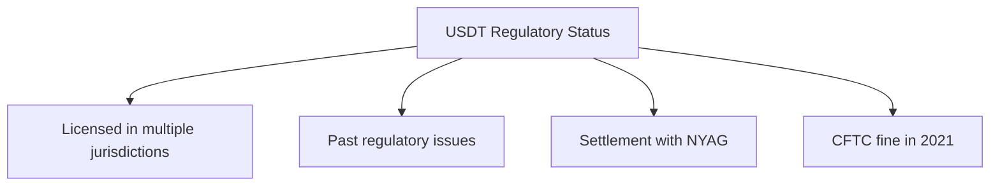
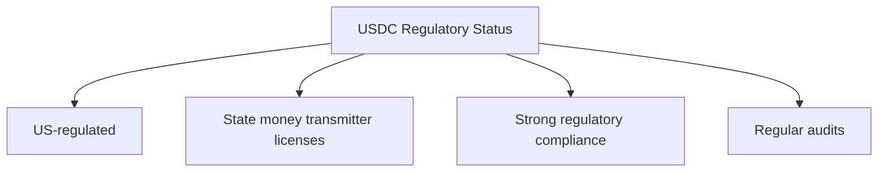

# USDT vs USDC: A Comprehensive Comparison

## Quick Overview

## Key Differences

### 1. Issuer & Governance

#### USDT (Tether)
- **Issuer**: Tether Limited
- **Parent Company**: iFinex Inc.
- **Governance**: Centralized
- **Headquarters**: Hong Kong/British Virgin Islands

#### USDC (Circle)
- **Issuer**: Circle & Coinbase (Centre Consortium)
- **Parent Company**: Circle Internet Financial
- **Governance**: More regulated
- **Headquarters**: United States

### 2. Backing & Reserves

#### USDT
- **Reserve Composition**:
  - US Treasury Bills
  - Cash & Bank Deposits
  - Commercial Paper (reduced)
  - Other Investments
- **Transparency**: Monthly attestations by BDO

#### USDC
- **Reserve Composition**:
  - Cash (held in regulated banks)
  - US Treasury Bills
  - No commercial paper
- **Transparency**: Monthly attestations by Grant Thornton

### 3. Regulatory Compliance

#### USDT

#### USDC

### 4. Technical Implementation

#### USDT
- **Blockchain Support**:
  - Ethereum (ERC-20)
  - Tron (TRC-20)
  - Solana (SPL)
  - Many others (40+ chains)
- **Smart Contract**: More basic implementation
- **Features**: Basic transfer and approval

#### USDC
- **Blockchain Support**:
  - Ethereum (ERC-20)
  - Solana (SPL)
  - Algorand
  - Others (fewer chains than USDT)
- **Smart Contract**: More advanced features
- **Features**: Includes blacklisting, upgradeability

### 5. Market Presence

#### USDT
- **Trading Pairs**: Most extensive
- **Exchange Support**: Universal
- **Market Share**: Largest stablecoin
- **Daily Volume**: Higher

#### USDC
- **Trading Pairs**: Growing
- **Exchange Support**: Widespread
- **Market Share**: Second largest
- **Daily Volume**: Lower but significant

### 6. Use Cases

#### USDT
- **Primary Uses**:
  - Trading
  - Cross-border payments
  - DeFi (less common)
  - Speculation

#### USDC
- **Primary Uses**:
  - DeFi applications
  - Institutional transfers
  - Business payments
  - Smart contract integration

## Security Considerations

### USDT Security
1. **Smart Contract Security**
   - Basic functionality
   - Well-tested
   - Multiple audits
   - Long track record

2. **Operational Security**
   - Centralized control
   - Emergency pause function
   - Blacklisting capability

### USDC Security
1. **Smart Contract Security**
   - Advanced functionality
   - Regular updates
   - Multiple audits
   - Newer but robust

2. **Operational Security**
   - Multi-signature control
   - Upgradeability
   - Strong compliance features

## Pros and Cons

### USDT Pros
1. Highest liquidity
2. Most trading pairs
3. Widest blockchain support
4. Long track record

### USDT Cons
1. Less transparent reserves
2. Regulatory concerns
3. Past controversies
4. Less regulatory compliance

### USDC Pros
1. Strong regulatory compliance
2. Transparent reserves
3. Better for institutions
4. Advanced smart contract features

### USDC Cons
1. Lower liquidity than USDT
2. Fewer supported chains
3. More centralized control
4. Higher compliance requirements

## Best Use Cases

### When to Use USDT
1. Trading on exchanges
2. Quick transfers between exchanges
3. International payments
4. When maximum liquidity is needed

### When to Use USDC
1. DeFi applications
2. Institutional transactions
3. Regulatory-sensitive operations
4. Smart contract integration

## Future Outlook

### USDT Development
- Expanding to more chains
- Improving transparency
- Enhancing regulatory compliance
- Maintaining market dominance

### USDC Development
- Growing institutional adoption
- Expanding DeFi integration
- Enhanced regulatory framework
- New blockchain support

## Risk Considerations

### USDT Risks
1. Regulatory uncertainty
2. Reserve questions
3. Market dominance concerns
4. Historical volatility

### USDC Risks
1. Regulatory changes
2. Centralization risks
3. Smart contract risks
4. Market competition

## Conclusion

Both stablecoins serve important but slightly different purposes:
- **USDT**: Better for trading, wider availability
- **USDC**: Better for institutional use, stronger regulation

Choice depends on:
1. Use case
2. Regulatory requirements
3. Geographic location
4. Risk tolerance
