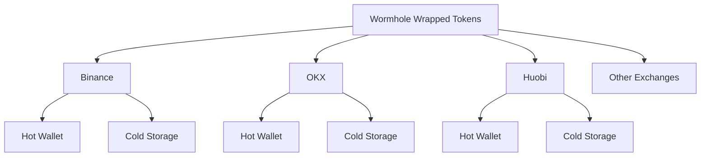
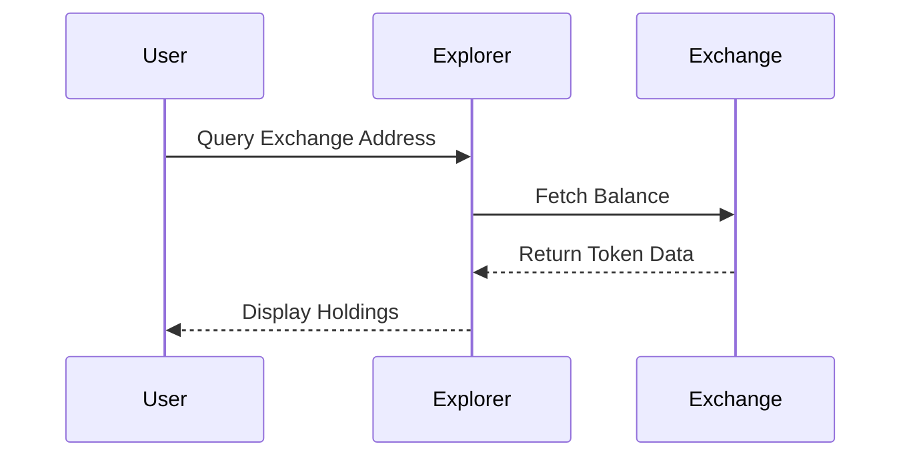
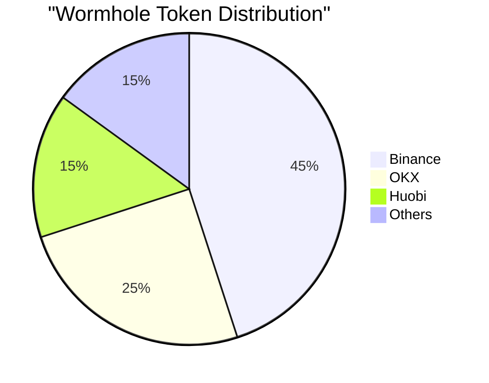
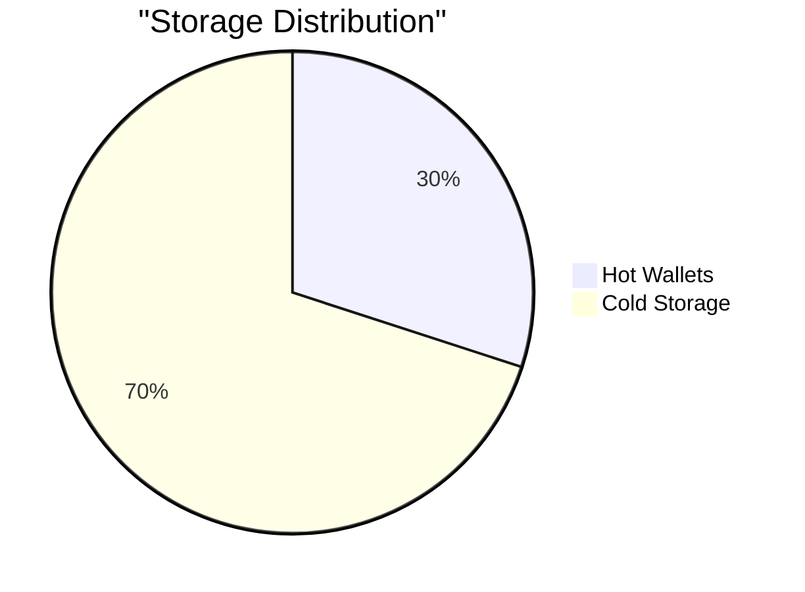

# Wormhole Token Distribution Across Exchanges

## Overview of Wormhole Wrapped Tokens



## How to Track Exchange Holdings

### 1. Using Wormhole Explorer
- **URL**: [https://wormholescan.io](https://wormholescan.io)
- **Features**:
  - Track wrapped tokens
  - Monitor transfers
  - View exchange wallets
  - Historical data

### 2. Major Exchange Wallets

#### Binance
```
Known Wallets:
- Hot Wallet: 0x28C6c06298d514Db089934071355E5743bf21d60
- Cold Wallet: 0x21a31Ee1afC51d94C2eFcCAa2092aD1028285549
```

#### OKX
```
Known Wallets:
- Hot Wallet: 0x6Cc5F688a315f3dC28A7781717a9A798a59fDA7b
- Cold Storage: 0x1c84dB0a575777670bE5681113Cec5E3B522E4C3
```

#### Huobi
```
Known Wallets:
- Hot Wallet: 0xaB5C66752a9e8167967685F1450532fB96d5d24f
- Cold Storage: 0x0a98fb70939162725ae66e626fe4b52cff62c2e5
```

## Tracking Methods

### 1. Direct Blockchain Analysis


### 2. Using Analytics Tools

#### DefiLlama
- Track TVL per exchange
- Monitor token flows
- View historical data
- Compare exchanges

#### Dune Analytics
- Custom queries for exchange balances
- Token distribution charts
- Flow analysis
- Historical trends

## Real-time Monitoring

### 1. Exchange Hot Wallets
- Monitor inflows/outflows
- Track balance changes
- Alert on large movements
- Identify patterns

### 2. Cold Storage
- Track long-term holdings
- Monitor security transfers
- Analyze reserve ratios
- Verify proof of reserves

## Sample Queries

### 1. Dune Analytics Query
```sql
SELECT
    exchange,
    token_address,
    sum(amount) as total_balance
FROM wormhole_wrapped_tokens
WHERE exchange IN ('Binance', 'OKX', 'Huobi')
GROUP BY exchange, token_address
ORDER BY total_balance DESC
```

### 2. Etherscan API
```javascript
const ETHERSCAN_API = 'https://api.etherscan.io/api';
const params = {
    module: 'account',
    action: 'tokenbalance',
    contractaddress: WORMHOLE_TOKEN_ADDRESS,
    address: EXCHANGE_WALLET,
    tag: 'latest'
};
```

## Distribution Analysis

### 1. By Exchange Size


### 2. By Storage Type


## Best Practices for Monitoring

### 1. Regular Checks
- Daily balance verification
- Weekly trend analysis
- Monthly distribution review
- Quarterly audit comparison

### 2. Security Considerations
- Monitor unusual movements
- Track large transfers
- Verify cold storage
- Check proof of reserves

### 3. Data Sources
- Blockchain explorers
- Exchange APIs
- Analytics platforms
- Official announcements

## Tools for Analysis

### 1. Blockchain Explorers
- Etherscan
- BscScan
- SolanaExplorer
- WormholeScan

### 2. Analytics Platforms
- Dune Analytics
- DefiLlama
- Nansen
- Glassnode

### 3. Exchange Data
- Official APIs
- Public wallets
- Proof of reserves
- Transparency reports

## Risk Assessment

### 1. Concentration Risk
- Exchange dominance
- Geographic distribution
- Storage distribution
- Network dependencies

### 2. Security Measures
- Multi-signature wallets
- Cold storage ratio
- Insurance coverage
- Audit frequency

## Reporting Tools

### 1. Exchange Reports
- Balance sheets
- Token distributions
- Flow analysis
- Risk metrics

### 2. Custom Dashboards
- Real-time monitoring
- Historical trends
- Alert systems
- Comparative analysis

## Future Developments

### 1. Enhanced Transparency
- Improved reporting
- Better tracking tools
- More detailed analytics
- Standardized metrics

### 2. Integration Improvements
- Cross-exchange analysis
- Automated monitoring
- Risk assessment tools
- Compliance tracking

## Tips for Users

### 1. Verification
- Check multiple sources
- Verify wallet addresses
- Monitor official channels
- Cross-reference data

### 2. Security
- Use official explorers
- Verify signatures
- Check timestamps
- Monitor alerts

### 3. Analysis
- Track trends
- Compare exchanges
- Monitor flows
- Assess risks
