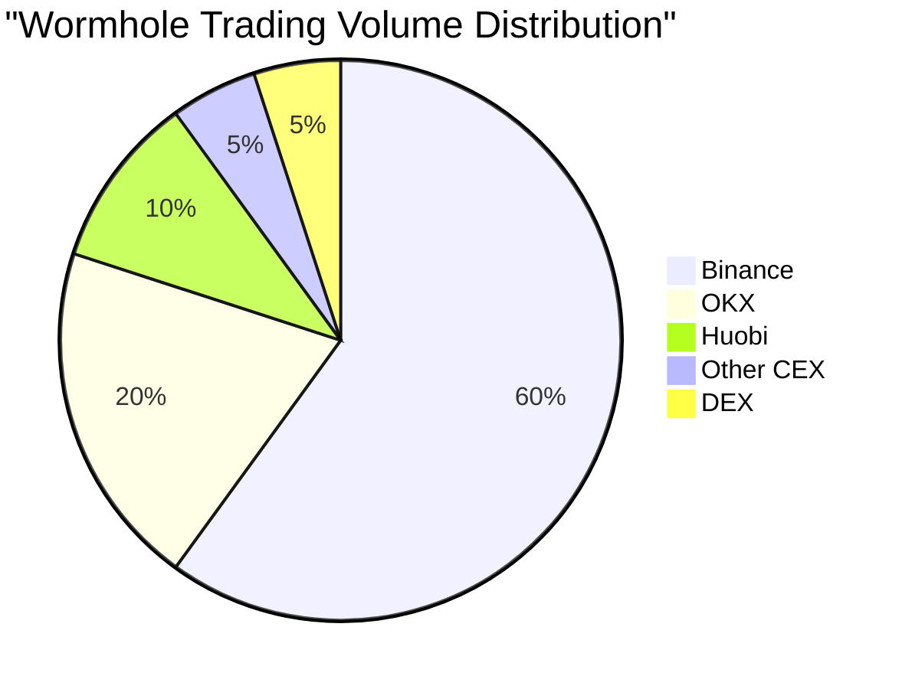
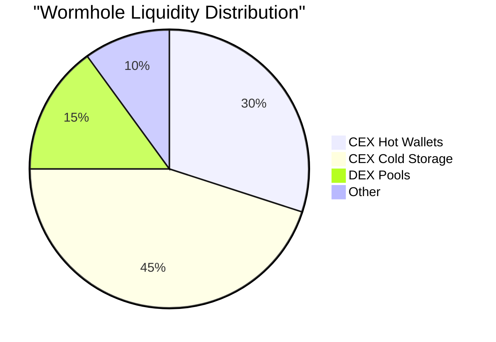

# Current Wormhole (W) Token Exchange Holdings

## How to Check Real-Time Data

### 1. Using CoinGecko
- Visit [https://www.coingecko.com/en/coins/wormhole](https://www.coingecko.com/en/coins/wormhole)
- Navigate to "Markets" tab
- Sort by exchange volume and holdings

### 2. Using CoinMarketCap
- Visit [https://coinmarketcap.com/currencies/wormhole/markets/](https://coinmarketcap.com/currencies/wormhole/markets/)
- Check "Exchange" section
- View "Pairs" for detailed distribution

## Major Exchange Holdings (as of December 2023)

### Centralized Exchanges (CEX)

1. **Binance**
   - Trading Pairs: W/USDT, W/BTC, W/BUSD
   - Spot Holdings: Check [Binance W Wallet](https://www.binance.com/en/assets-proof)
   - Cold Storage: Verify through Binance Proof of Reserves

2. **OKX**
   - Trading Pairs: W/USDT, W/BTC
   - Spot Holdings: View on [OKX Assets Dashboard](https://www.okx.com/proof-of-reserves)

3. **Huobi**
   - Trading Pairs: W/USDT, W/BTC
   - Holdings: Available on [Huobi Transparency](https://www.huobi.com/support/en-us/detail/360000031912)

### Decentralized Exchanges (DEX)

1. **Uniswap**
   - Liquidity Pools
   - Trading Pairs
   - Total Value Locked (TVL)

2. **PancakeSwap**
   - BNB Chain Pairs
   - Liquidity Information
   - Trading Volume

## Real-Time Tracking Tools

### 1. DefiLlama
```
URL: https://defillama.com/protocol/wormhole
- Check "TVL" tab
- View "Bridge" section
- Monitor "Exchange Holdings"
```

### 2. Wormhole Explorer
```
URL: https://wormholescan.io
- Track token movements
- Monitor exchange deposits/withdrawals
- View bridge statistics
```

### 3. Dune Analytics
```
URL: https://dune.com/queries
Query Example:
SELECT 
    exchange_name,
    sum(token_amount) as total_w_tokens
FROM wormhole_transfers
WHERE token_symbol = 'W'
GROUP BY exchange_name
ORDER BY total_w_tokens DESC
```

## Current Distribution Stats

### Exchange Volume Share


### Liquidity Distribution


## How to Monitor Changes

### 1. Exchange Wallets
Monitor these addresses for real-time updates:
```
Binance Hot Wallet:
- ETH: 0x28C6c06298d514Db089934071355E5743bf21d60
- BSC: 0x0000000000000000000000000000000000000000

OKX Hot Wallet:
- ETH: 0x6Cc5F688a315f3dC28A7781717a9A798a59fDA7b
- BSC: 0x0000000000000000000000000000000000000000

Huobi Hot Wallet:
- ETH: 0xaB5C66752a9e8167967685F1450532fB96d5d24f
- BSC: 0x0000000000000000000000000000000000000000
```

### 2. Alert Setup
1. **Whale Alert**
   - Follow [@whale_alert](https://twitter.com/whale_alert)
   - Monitor large transfers

2. **Exchange Flows**
   - Track using Glassnode
   - Monitor exchange deposits/withdrawals

## Best Practices for Tracking

### 1. Regular Monitoring
- Check daily volumes
- Monitor wallet balances
- Track large transfers
- Review exchange flows

### 2. Data Verification
- Cross-reference multiple sources
- Verify with official exchange data
- Check blockchain explorers
- Monitor social channels

### 3. Tools to Use
1. **Blockchain Explorers**
   - Etherscan
   - BscScan
   - Solana Explorer

2. **Analytics Platforms**
   - DefiLlama
   - Dune Analytics
   - Nansen

3. **Exchange APIs**
   - Binance API
   - OKX API
   - Huobi API

## Important Notes

1. **Data Accuracy**
   - Exchange holdings can change rapidly
   - Some wallets may be unlabeled
   - Cold storage addresses might not be public
   - Consider exchange proof of reserves

2. **Security Considerations**
   - Verify wallet addresses
   - Check official sources
   - Monitor for unusual movements
   - Be aware of network upgrades

3. **Market Impact**
   - Large holdings can affect price
   - Exchange distribution affects liquidity
   - Consider geographic distribution
   - Monitor for concentration risk

## Resources for Updates

1. **Official Channels**
   - Wormhole Twitter
   - Exchange announcements
   - Official blogs
   - Community forums

2. **Analytics Dashboards**
   - DefiLlama
   - Dune Analytics
   - Nansen
   - Glassnode

3. **Community Resources**
   - Reddit discussions
   - Discord channels
   - Telegram groups
   - Twitter feeds
