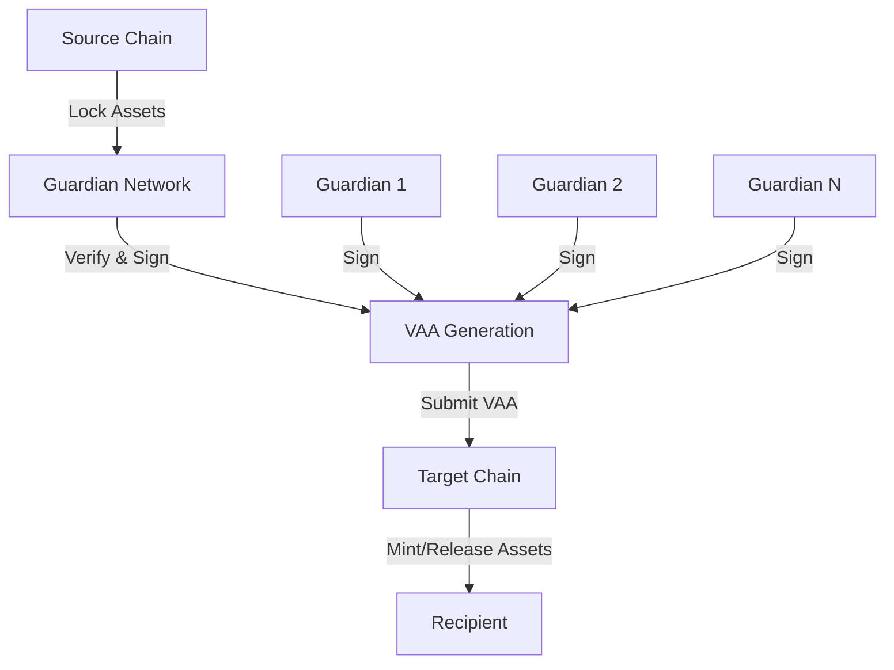
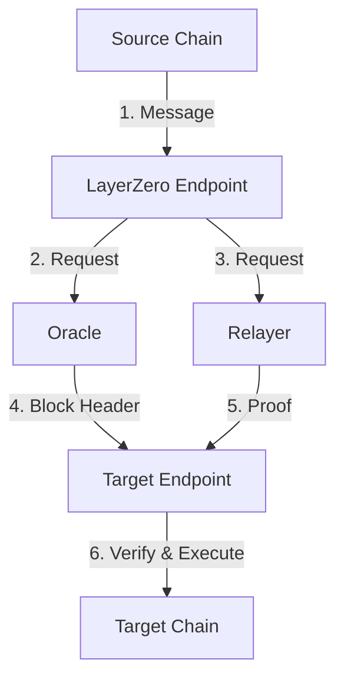

# Wormhole vs LayerZero: A Comprehensive Comparison

## Architecture Overview

### Wormhole

### LayerZero

## Detailed Comparison

### 1. Core Architecture
#### Wormhole
- **Design**: Decentralized Guardian network
- **Consensus**: Multi-party computation (MPC)
- **Message Format**: Verified Action Approvals (VAAs)
- **Network Size**: 19 Guardians
- **Validation**: 13/19 Guardian signatures required

#### LayerZero
- **Design**: Ultra-light node architecture
- **Consensus**: Dual Oracle-Relayer system
- **Message Format**: Generic messaging
- **Network Size**: Configurable Oracle and Relayer
- **Validation**: Oracle verification + Relayer proof

### 2. Security Model

#### Wormhole
- **Trust Assumptions**:
  - Guardian network honesty (⅔ majority)
  - Smart contract security
  - No single point of failure
- **Security Features**:
  - Multi-signature requirement
  - Threshold cryptography
  - Automatic network recovery
  - Slashing for malicious behavior

#### LayerZero
- **Trust Assumptions**:
  - Oracle accuracy
  - Relayer reliability
  - Smart contract security
- **Security Features**:
  - Configurable trustlessness
  - Default and custom security settings
  - Multiple oracle/relayer options
  - Proof verification system

### 3. Performance & Scalability

#### Wormhole
- **Speed**: 
  - VAA generation: ~15 seconds
  - Total transfer: 2-5 minutes
- **Throughput**: ~1000 TPS
- **Supported Chains**: 30+
- **Cost Structure**: 
  - Guardian fees
  - Gas fees on both chains

#### LayerZero
- **Speed**:
  - Message delivery: ~1-2 minutes
  - Total transfer: 2-4 minutes
- **Throughput**: ~2000 TPS
- **Supported Chains**: 25+
- **Cost Structure**:
  - Oracle fees
  - Relayer fees
  - Gas fees on both chains

### 4. Use Cases & Applications

#### Wormhole
- **Primary Use Cases**:
  - Token bridges
  - NFT transfers
  - Cross-chain governance
  - Generic message passing
- **Notable Projects**:
  - Portal Bridge
  - Token Bridge
  - NFT Bridge

#### LayerZero
- **Primary Use Cases**:
  - Cross-chain DeFi
  - Omnichain applications
  - Gaming
  - Messaging protocols
- **Notable Projects**:
  - Stargate Finance
  - ApeCoin Bridge
  - OmniChain NFT

### 5. Developer Experience

#### Wormhole
- **Integration Complexity**: Moderate
- **Documentation**: Comprehensive
- **SDK Support**: Multiple languages
- **Testing Environment**: Available testnet
- **Development Tools**:
  - Guardian monitoring
  - VAA explorer
  - Testing framework

#### LayerZero
- **Integration Complexity**: Low to Moderate
- **Documentation**: Extensive
- **SDK Support**: Multiple languages
- **Testing Environment**: Available testnet
- **Development Tools**:
  - Endpoint explorer
  - Message monitor
  - Testing suite

## Pros and Cons

### Wormhole
#### Pros
- Strong decentralization
- Battle-tested security
- Wide chain support
- Generic message passing
- Active developer community

#### Cons
- Higher latency due to Guardian consensus
- More complex integration
- Higher costs for small transfers

### LayerZero
#### Pros
- Flexible security configuration
- Lower latency
- Simpler integration
- Cost-effective for small transfers
- Customizable trust model

#### Cons
- Reliance on external oracles
- Newer protocol (less battle-tested)
- Potential oracle/relayer risks

## Best Use Cases

### When to Choose Wormhole
1. High-value transfers requiring maximum security
2. Projects needing proven track record
3. Complex cross-chain applications
4. When decentralization is priority

### When to Choose LayerZero
1. Speed-sensitive applications
2. Cost-sensitive transfers
3. Custom security requirements
4. Simple cross-chain messaging needs

## Future Development

### Wormhole
- Expanding chain support
- Improving Guardian infrastructure
- Enhanced security features
- Performance optimizations

### LayerZero
- Additional chain integrations
- New oracle/relayer options
- Protocol optimizations
- Enhanced developer tools
